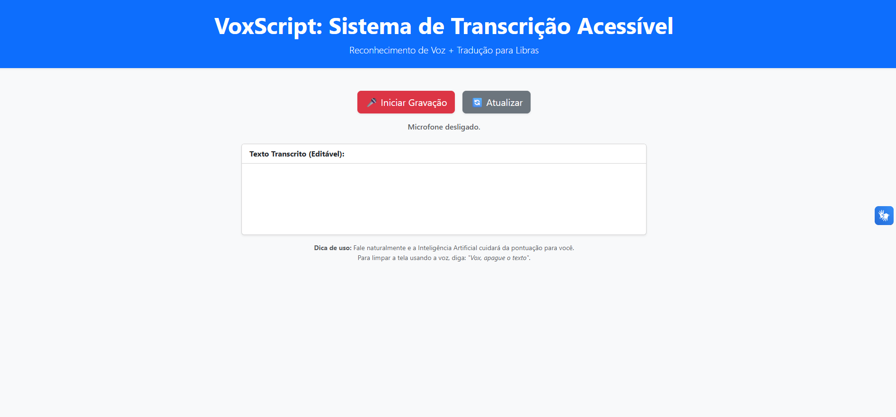
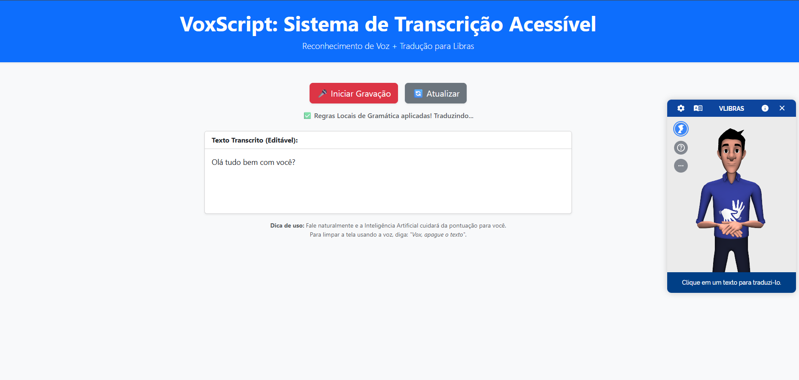

# Prints de Tela

# Prints de Tela

Abaixo estão apresentados os registros visuais das principais interfaces e funcionalidades desenvolvidas na aplicação VoxScript.

  
  &nbsp;
  

  <em>Figura 1 (Esquerda): Interface inicial com botões de controle. Figura 2 (Direita): Demonstração do reconhecimento de voz e pontuação automática aplicados.</em>

Coloque aqui os prints de tela da aplicação desenvolvida.

> **Exemplos:** tela inicial, telas de funcionalidades principais, tela de cadastro, resultados, etc.
> Estes prints serão anexados ao relatório enviado na atividade do Canvas.
